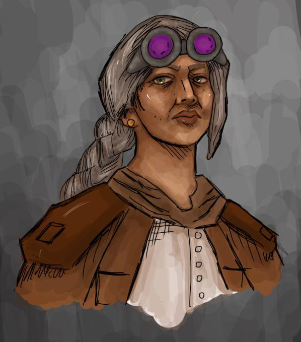

<a href="README.md">Home</a>

<h1 id="dungeons-dragons">Dungeons &amp; Dragons</h1>

Throughout my highschool and college years I have enjoyed playing and running games of Dungeons &amp; Dragons, I started out through my brother Nick&#39;s birthday party. Starting out as a ranger, then playing a barbarian with some cousins.

Later down the line my brother introduced me to <strong><em>Critical Role</em></strong>,a D&amp;D liveshow/podcast on Youtube and Twitch. The show iteself is played and ran by mostly voice actors, the main cast all being voice actors. The Dungeon MAster (the guy who runs the game, npcs, world, almost everything) is Matt Mercer, one of the famous voice actors, he has worked in video games, anime, and animated movies/show. Critical Role both influences how My brother and I run games. Click <a href="https://www.youtube.com/c/criticalrole">here</a> to check out their Youtube channel.

After that My brother started up a campaign, he invited his friends and I to play, so I got to make my second legitimate character, (we ran a campaign beforehand but we got killed off pretty quick) Mabel Wesson. she was an artificer, a magical inventor of sorts, but I played sort of as an old Sara Connor type of character, a veteran combat medic. She ran around with a robotic panther and a double barreled shotgun. It was fun as hell, but she also ended up dying later down the lie.

A picture of Mabel drawn by my friend:

Now a days I run D&amp;D games for my friends online and friends in my college dorm. The one I run online is just dungeon crawls, and the dorm campaign is a seafarring adventure in a setting I made called <em>The Sea of Whales</em>. I has quite the experiance for both, because the groups have a party size of 7 for the online one, and 8 for the college one. It&#39;s gonna be one wild ride!

